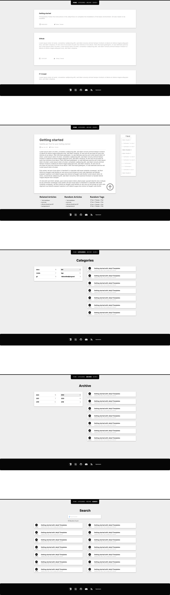

# Erste Schritte

```bash
jekyll serv #startet den eingebauten Server
```

## Konfiguration

findet über `_config.yml` statt

Default Konfigurationen: https://jekyllrb.com/docs/configuration/default/

## Post Default Layout

http://jekyllrb.com/docs/configuration/front-matter-defaults/

```bash
vi _config.yml
	defaults:
	  -
	    scope:
	      path: "" # ein leerer string an dieser Stelle bezieht alle Projektateien ein
	      type: "posts"
	    values:
	      layout: "default"
```

## Front Matter (Metadaten)

Wird im Post erstellt, und ganz oben mit 3x `-` eingeleitet und beendet.
Wird von Jekyll gelesen und verwendet.

Hier können auch eigene Variablen festgelegt und benannt werden.

Diese Variablen können dann in Templates, Schleifen und IF-Abfragen verwendet werden.

In `_config` können unter `default: values:` default Werte festgelegt werden.

Beispiel:

```yaml
---
layout: post
title:  "Welcome to Jekyll!"
date:   2023-06-06 13:13:20 +0200
categories: jekyll update
---
```


## Anderes Theme installieren

https://github.com/StartBootstrap/startbootstrap-clean-blog-jekyll


```bash
vi Gemfile #gem "jekyll-theme-clean-blog".
bundle install
vi _config.yml #theme: jekyll-theme-clean-blog
bundle exec jekyll serve
```


## markdown

als default markdown wird https://kramdown.gettalong.org/quickref.html verwendet.


# Installation

Laut Tutorial: https://jekyllrb.com/docs/step-by-step/01-setup/

```bash
sudo apt-get install ruby-full build-essential zlib1g-dev

#Avoid installing RubyGems packages (called gems) as the root user. Instead, set up a gem installation directory for your user account. The following commands will add environment variables to your ~/.bashrc file to configure the gem installation path:

echo '# Install Ruby Gems to ~/gems' >> ~/.bashrc
echo 'export GEM_HOME="$HOME/gems"' >> ~/.bashrc
echo 'export PATH="$HOME/gems/bin:$PATH"' >> ~/.bashrc
source ~/.bashrc

gem install jekyll bundler
```

**Neues Projekt**

```bash
#1 Möglichkeit
jekyll new myblog
cd myblog
bundle install
bundle exec jekyll serve

#2. Möglichkeit
vi Gemfile #gem "jekyll"
bundle init
```


**Upgrade**

```bash
jekyll -v
gem update jekyll
```


# Publish in GitPages

https://docs.github.com/de/pages/quickstart
https://docs.github.com/en/pages/setting-up-a-github-pages-site-with-jekyll/creating-a-github-pages-site-with-jekyll

Bei [github](https://github.com/) ein neues Repository mit dem Repository-Name: papierkorp.github.io hinzufügen.
Anschließend im Repo in `Settings - Pages - Source - Deploy from a branch` und `Settings - Pages - Source - Branch - main`

Seite ist jetzt erreichbar unter: https://papierkorp.github.io

Custom Domain auch in github im Repo unter `Settings - Pages - Custom Domain` eintragen und im DSN den CNAME auf `papierkorp.github.io` verlinken.


# Eigenes Theme erstellen

Offizielle Doku: https://jekyllrb.com/docs/themes/

Alle templates und Layouts werden in einem Ruby gem gespeichert. Das Ruby gem wird später durch den `build` command erstellt und ins Ruby Repo gepusht.


**Vorlage.png erstellen**

Hab mir [Lunacy](https://icons8.de/lunacy) installiert und erstmal durch folgende Inspirationen eine Design erstellt:

- Navigation/Layout: https://beautifuljekyll.com/
- Archiv/Search/Cards/TOC: https://chirpy.cotes.page/archives/
- Categories/Navi: https://mmistakes.github.io/so-simple-theme/categories/
- Categories/TOC: https://jeffreytse.github.io/jekyll-theme-yat/categories.html
- Home/Cards/TOC/Category: https://unifreak.github.io/
- Cards: https://mmistakes.github.io/jekyll-theme-hpstr/
- TOC: https://mmistakes.github.io/minimal-mistakes/docs/quick-start-guide/




**Theme erstellen**

- Beachten
	+ [Jekyll Remote Theme](https://github.com/benbalter/jekyll-remote-theme) beachten: => Plugins müssen [Github Approved sein](https://learn.siteleaf.com/themes/jekyll-plugins/#github-pages-approved-plugins&gsc.tab=0)
	+ Jekyll inkludiert einen SASS/SCSS Compiler => SASS statt CSS verwenden
		* [SASS/SCSS](#sass) erweitert CSS und macht CSS deutlich flexibler wie bessere Syntax, Nesting, Variablen, Mixins... 
- Links
	+ Gemfile erstellen: https://medium.com/@jameshamann/creating-your-own-jekyll-theme-gem-1f8180a0e4b8
	+ Erste Schritte: https://www.siteleaf.com/blog/making-your-first-jekyll-theme-part-2/
	+ Liquid (Bibliothek um Layouts zu erstellen): https://shopify.github.io/liquid/basics/introduction/
	+ Jekyll Hilfe: https://mademistakes.com/articles/going-static/
		* https://html5boilerplate.com/
		* https://html5doctor.com/


```bash
jekyll new-theme papierkorp-theme
tree papierkorp-theme
	├── Gemfile 					#verweist auf .gemspec
	├── LICENSE.txt					
	├── README.mkdir				
	├── _data						
	├── _includes					#templates
	├── _layouts					#Default Styles erstellen
	│   ├── default.html 			
	│   ├── page.html 				
	│   └── post.html 				
	├── _sass						#css
	├── assets						#static files (main styles.scss)
	└── papierkorp-theme.gemspec	#alle ruby gem Daten (Version, Name, Beschreibung...)

cd papierkorp-theme
```

Als erstes index.html und Beispielposts erstellen:

```bash
vi index.html #{{ content }} ist Liquid Syntax (siehe Link oben)

	---
	title: Home
	layout: post
	---
	{{ content }}

mkdir _posts #Beispielposts erstellen
vi ./_posts/2023-06-01-example-post.md
vi vi ./_config.yml #Default config.yml mitgeben

bundle exec jekyll serve --watch #lokalen Server für das Theme starten
```

Style implementieren:

```bash
vi Gemfile
	gem 'jekyll-sass-converter'
mkdir _sass
mkdir /_sass/header
mkdir assets
vi /_sass/papierkorp-theme.scss
	//@import "header"
	//@import "header/xxx"
	.test {
		background-color: yellow;
	}
vi /assets/styles.scss
	---

	---
	@charset "utf-8";
	@import "papierkorp-theme";
vi /_includes
	<link rel="stylesheet" href="{{ '/assets/style.css' | relative_url }}">
```


**Mit neuen Projekt testen**

```bash
gem build papierkorp-theme.gemspec #erstellt eine gem file im Ordner, dieses gem File (Pfad) bei meiner Jekyll Seite hinzufügen
jekyll new testblog
vi Gemfile
	gem "papierkorp-theme" => :path => "C:\develop\papierkorp-theme-0.1.0.gem"
bundle
vi _config.yml
	theme: papierkorp-theme
bundle exec jekyll serve --watch
```


**Live gehen**

Bei [Ruby Gems](https://rubygems.org/) registrieren um das Theme später hochzuladen.

```bash
#Erstellen
vi ./screenshot.png #screenshot.png in root dir speichern
vi papierkorp-theme.gemspec #Zum Finish die gemspec Datei mit Version, Author, Files befüllen
gem build papierkorp-theme.gemspec
gem push papierkorp-theme.gem
gem yank papierkorp-theme #theme wieder löschen fals Fehler passiert sind
```


# SASS

```sass
#Syntax .sass
nav
	ul
		margin: 0
		padding: 0
		list-style: none
	li
		display: inline-block
	a
		display: block
		padding: 6px 12px
		text-decoration: none
```

```scss
#syntax .scss
nav {
	ul {
		margin: 0
		padding: 0
		list-style: none
	}

	li {
		display: inline-block
	}

	a {
		display: block
		padding: 6px 12px
		text-decoration: none
	}
}


#variables
$red: hsl(0, 100%, 50%);

.button.danger {
	color: $red;
	border: 1px solid $red;
}


#Nesting
#&=refer to parent selector
.btn {
	&:focus {}
	&:hover {}
	&:active {}
}


#Funktionalität
@mixin flex-column($color) {
	display: flex;
	flex-direction: column;
	background-color: $color;
}

.card {
	@include flex-column(black);
}

@mixin theme-colors($theme) {
	@if $theme == 'light' {} @else {} 
}

$sizes: 40px, 50px, 80px;
@each $size in $sizes {
	.icon-#{$size} {
		font-size: $size;
	}
}

@function sum($numbers) {
	$sum: 0;

	@each $number in $numbers {
		$sum: $sum + $number;
	}

	@return $sumn;
}

.card {background: lighten(green, 25%)}


#Inheritance
.base-style {
  font-size: 18px;
  line-height: 1.6;
}

.heading {
  @extend .base-style;
  font-weight: bold;
}
```